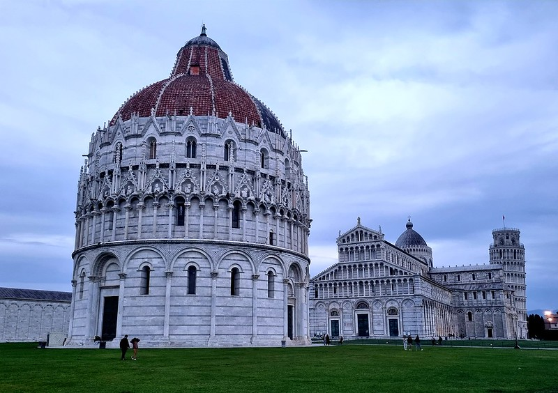
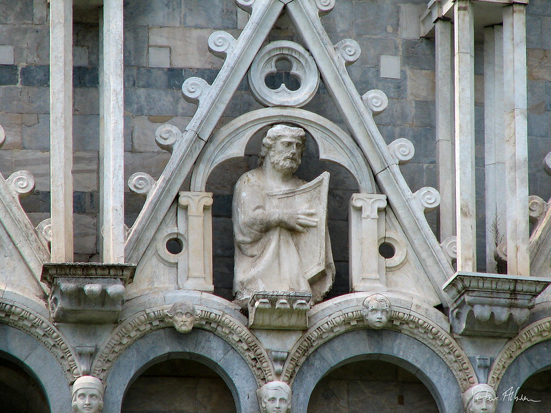
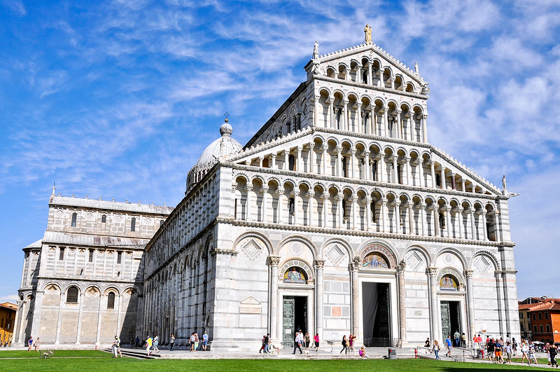

# Urban Region Description

Urban Region Description is a research project that introduces a novel method for identifying and describing urban regions. This method leverages geolocated images. Initially, we cluster the images using the HDBSCAN algorithm. Then, we refine the clusters by exploiting the semantics contained in the captions we generate for each image. Finally, we use the new clusters to produce textual descriptions of the resulting regions. For both the captioning and summarization phases, we leverage the power of different Large Language Models (LLMs).

## Installation
To install the necessary dependencies, run the following command:
```bash
pip install -r requirements.txt
```
## Usage
To use the Urban Region Description project, follow these steps:

1. Configure all parameters you want into the `config.json` file.
2. Place your image dataset into the `data` folder.

## Example
Here's an example of how to use this project:

Let's say we have 3 images from a cluster in Pisa. After processing these images through our pipeline, the output will be a textual description of the cluster. This showcases how our project can take a set of images and generate a meaningful description of the urban region they represent. 

#### Cluster:
<p float="left">
  
   
  
</p>

#### Generated textual description:
```
The descriptions largely revolve around prominent
landmarks in Pisa, primarily the Pisa Cathedral and
the Leaning Tower of Pisa. Scenes include various
angles and perspectives of these landmarks from
different times, depictions of people interacting
with these sites, and artistic elements like
mosaics, sculptures, and architecture.
```